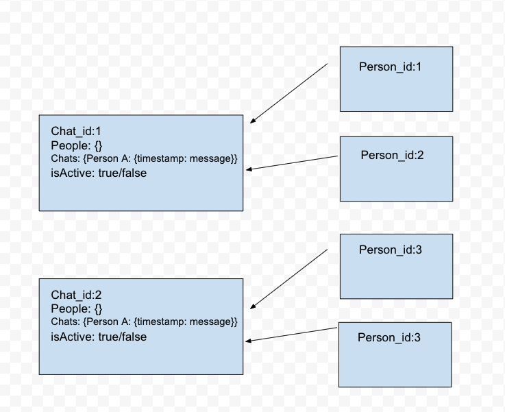
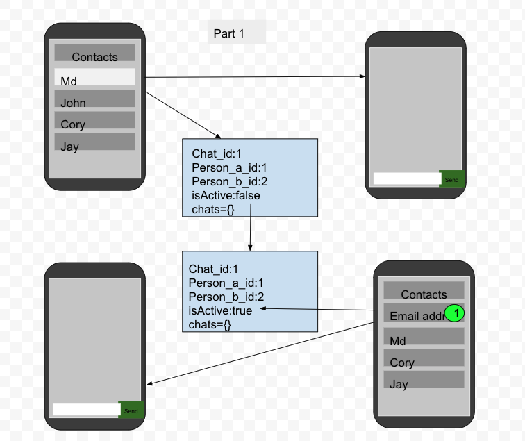
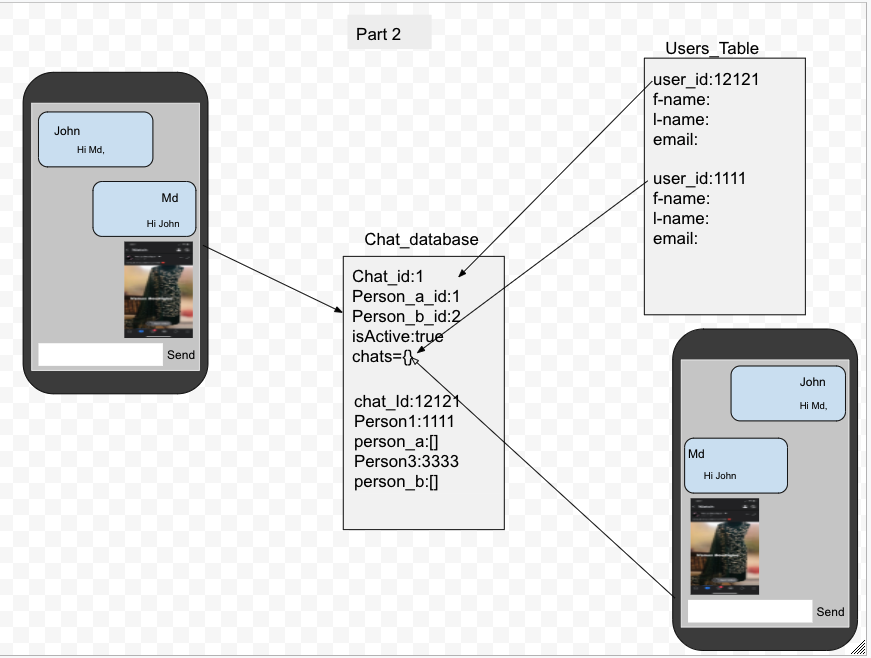
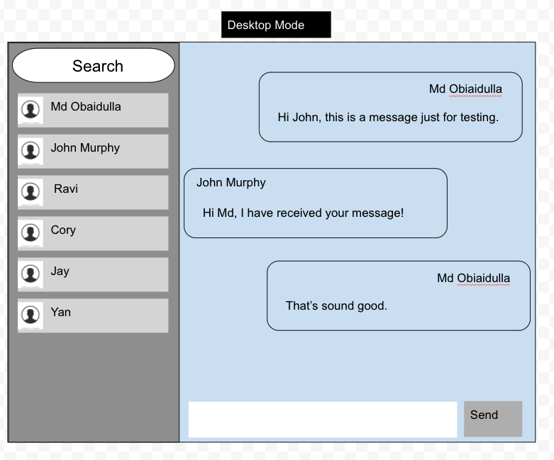

# Pru Full-stack Developers Chat App

This is a web based chat app that allows user to register by using their valid e-mail address. User will be able to creat chat room with any other registered user. When the chat room will be estabilished, both of the users will be able to enjoy live chat with each other. 

## List of Technology We Are Using

1. Node Js
2. Express
3. Mongodb
4. Mongoose
5. React Js
6. Semantic-ui-css
7. Semantic-ui-react
8. Flext box
9. Socket.io
10. Axios
11. Socket.io-client
12. Bcrypt
13. Cors
14. Dotenv
15. Express-session
16. Nodemailer
17. Js-base64
18. Heroku
19. Git/Github

## Project URL
UI link : https://chat-app-john-md-ui.herokuapp.com

API link: https://chat-app-john-md.herokuapp.com

## User Story

- [x] As a user, I want to create account by using valid e-mail address, First name and Last name.
- [x] As a administrator, I want to verify user's email address by sending a verification link to their e-mail
- [x] As a user, I want to login to the account with my username and password
- [x] As a user, I want to see all registered users so that I can chat with them
- [x] As a user, I want to be notified for any new incoming chat requested
- [x] As a user, I want to be notified for any new message from an existing chat room 
- [x] As a user, I want to be able to send the chat to any registered user
- [x] As a user, I want to be able to do real time communication with any registered users
- [x] As a user, I want to be able to delete any message from my chat room
- [x] As a user, I want to be able to delete any chat room that I have created
- [x] As a user, I want to see the timestamp of every chat message
- [x] As a user, I want to user this chat app in any mobile devices
- [x] As a user, I want to see all the sending message aligned to the right and receving messages aligned to the left
- [x] As a user, I want the system to automatically to scroll the last messages in the chat room
- [x] As a user, I want to see the Full-stack developer app's logo
- [x] As a user, I want to see professional styling in the app
- [x] As a registered user, I want to update my profile information
- [x] As a user, I want to logout from my account
- [x] As a user, I want be able to search any registered user by their e-mail
- [x] As a user, I want to see my full name after login my account to know that is my account

## Wireframe
### Part 1
 
### Part 2
 
### Part 3
 
### Part 4
 

## Rest API Routes

|            	|                                   	| Users      	|                                	|           	|
|------------	|-----------------------------------	|-----------	|--------------------------------	|-----------	|
| Route Name 	| URL                               	| HTTP Verb 	| Description                    	| Status    	|
| Index      	| /users                            	| GET       	| Get all users                    	| Completed 	|
| Show       	| /users/first_name/:id             	| GET       	| Get first name of user           	| Completed 	|
| Show       	| /users/last_name/:id              	| GET       	| Get last name of user            	| Completed 	|
| Show       	| /users/email/:id            	        | GET       	| Get email of user                	| Completed 	|
| Show       	| /users/:id                  	        | GET       	| Get one user                     	| Completed 	|
| Create     	| /users                      	        | POST      	| Create new user                  	| Completed 	|
| Show       	| /users/:id/verify/:uniqueid 	        | GET       	| Verify user                      	| Completed 	|
| Update     	| /users/:id                  	        | PUT       	| Update user's profile            	| Completed 	|

|            	|                                   	| Chat  	    |                                	|           	|
|------------	|-----------------------------------	|-----------	|--------------------------------	|-----------	|
| Route Name 	| URL                               	| HTTP Verb 	| Description                    	| Status    	|
| Index      	| /chats                            	| GET       	| Get all the chats                	| Completed 	|
| Show       	| /chats/chatroom/:id               	| GET       	| Get all the chats from chat room 	| Completed 	|
| Create     	| /chats                      	        | POST      	| Create a new chat                	| Completed 	|
| Delete     	| /chats/:id                  	        | DELETE    	| Delete a chat                    	| Completed 	|

|            	|                                   	| Chatroom  	|                                	|           	|
|------------	|-----------------------------------	|-----------	|--------------------------------	|-----------	|
| Route Name 	| URL                               	| HTTP Verb 	| Description                    	| Status    	|
| Index      	| /chatrooms                        	| GET       	| Get all chatrooms              	| Completed 	|
| Shaw       	| /chatrooms/chatroomWithUserId/:id 	| GET       	| Get all chatrooms with user id 	| Completed 	|
| Show       	| /chatrooms/getAllUsers/:id        	| GET       	| Get all users from chatroom    	| Completed 	|
| Show       	| /chatrooms/:id                    	| GET       	| Get chatroom                   	| Completed 	|
| Create     	| /chatrooms                        	| POST      	| Create new chatroom            	| Completed 	|
| Update     	| /chatrooms/:id                    	| PUT       	| Update a chatroom              	| Completed 	|
| Delete     	| /chatrooms/:id                    	| DELETE    	| Delete a chatroom              	| Completed 	|

| React Components  	|          |
| Components Name   | Descriptions                      	|
|-----------------	|-----------------------------------	|
| ChatBox         	| Managing chat text box            	|
| ChatRooms       	| Manages ChatRooms components      	|
| ChatRoom        	| Manages Chatroom component        	|
| ChatRoomControl 	| Manages control of the chatrooms  	|
| Conversation    	| Manages the conversation area     	|
| DropdownNewChat 	| Manages selection of new user     	|
| Layout          	| Manages the chat page layout      	|
| Message         	| Manages all the messages          	|
| Person          	| Manages the users in the chatroom 	|
| CreateUser      	| Manages the creation of new user  	|
| Landing         	| Manages the landing page          	|
| Profile         	| Manages the users profile         	|

## Future Enhancements

- [] As a user, I want to create a group chat room where multiple users will be able to chat in a chatroom
- [] As a user, I want to have the session after login to the account
- [] As a user, I want to share file, and image 
- [] As a user, I want to have video call feature in the app
- [] As a user, I want to purge old chat messages after specify inteval
- [] As a user, I want to archive all of my existing conversations
